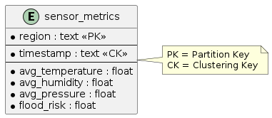

# Sensor Metrics Cassandra Schema

## Diagram


## Schema Definition
```sql
CREATE KEYSPACE IF NOT EXISTS crdp
WITH replication = {'class': 'SimpleStrategy', 'replication_factor': 1};

USE crdp;

CREATE TABLE IF NOT EXISTS sensor_metrics (
    region text,
    timestamp text,
    avg_temperature float,
    avg_humidity float,
    avg_pressure float,
    flood_risk float,
    PRIMARY KEY (region, timestamp)
) WITH CLUSTERING ORDER BY (timestamp DESC);
