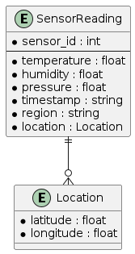

# Sensor Reading Avro Schema

## Diagram


## Schema Definition
```json
{
  "type": "record",
  "name": "SensorReading",
  "namespace": "crdp.net",
  "fields": [
    {"name": "sensor_id", "type": "int"},
    {"name": "temperature", "type": "float"},
    {"name": "humidity", "type": "float"},
    {"name": "pressure", "type": "float"},
    {"name": "timestamp", "type": "string"},
    {"name": "region", "type": "string"},
    {"name": "location", "type": {"type": "record", "name": "Location", "fields": [
      {"name": "latitude", "type": "float"},
      {"name": "longitude", "type": "float"}
    ]}}
  ]
}
